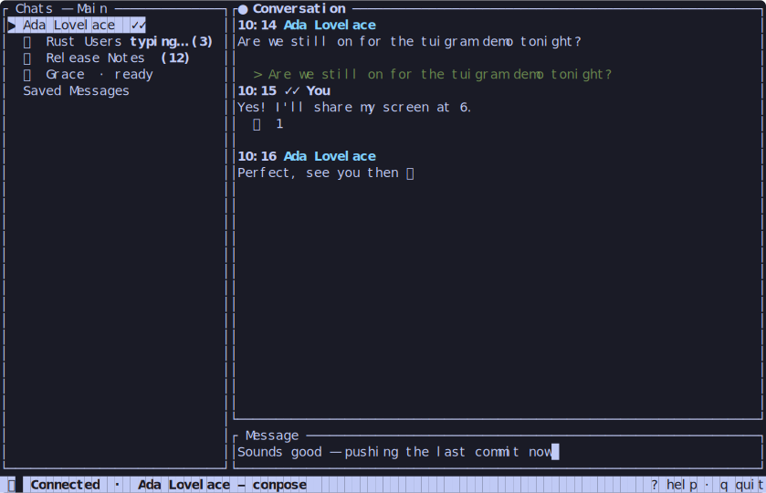

# tuigram

A terminal UI (Ratatui) Telegram client, written in Rust.



*(mockup rendered from synthetic data, not a live session)*

## Installing

- **macOS**: direct binary download is **not supported** — the release
  artifact ships unsigned, so a browser download hits Gatekeeper quarantine.
  Install via Homebrew:
  ```sh
  brew install queq-co/tuigram/tuigram
  ```
  or:
  ```sh
  cargo install tuigram-client --features static
  ```
- **Linux**: download the released `tuigram-<version>-linux-x86_64.tar.gz` (or
  `-linux-arm64.tar.gz`) from the [Releases page][releases] and run the
  `tuigram` binary directly. Needs a few native runtime libraries most distros
  already have — see [BUILD.md](BUILD.md#native-runtime-dependencies-openssl--zlib--libc) if `tuigram --version` fails to start.
- **Windows**: download the released `.zip` from the [Releases page][releases]
  and unpack it.
- **Power users / other platforms**: `cargo install tuigram-client --features
  static`, or `cargo binstall tuigram-client` to fetch a prebuilt instead of
  compiling (the crates.io package is `tuigram-client` — `tuigram` was already
  taken by an unrelated crate — but it installs a binary still named
  `tuigram`).

[releases]: https://github.com/queq-co/tuigram/releases

See [docs/releasing.md](docs/releasing.md) for how releases are built, and
[BUILD.md](BUILD.md) for building from source.

## First run

On first run, tuigram asks for your own Telegram `api_id`/`api_hash` (get a
free pair from https://my.telegram.org — Telegram requires every application
to use its own credentials, see
[docs/research/app-registration-security.md](docs/research/app-registration-security.md))
and walks you through login. Credentials and session data are saved to
`~/.config/tuigram/config.toml` (mode `600`); display/cache settings live in
`~/.config/tuigram/settings.toml`.

## Contributing

See [CONTRIBUTING.md](CONTRIBUTING.md).
